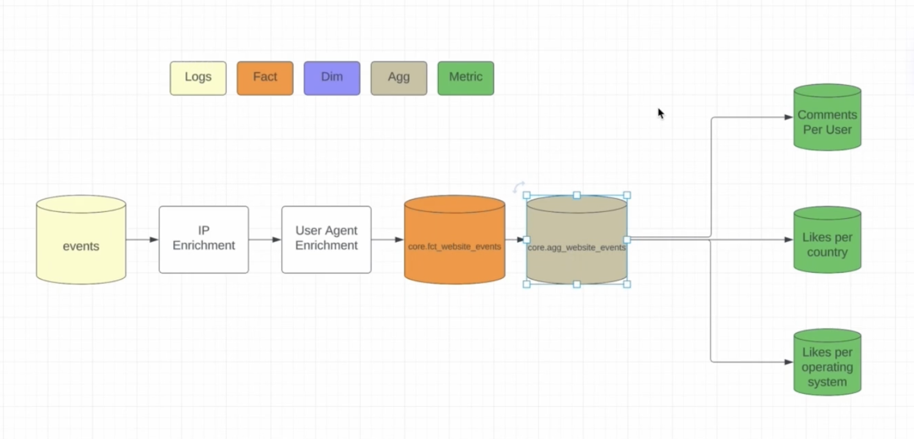

## User Growth Pipeline
The goal of this pipeline is to answer the following questions.
* How many users are using the app on a daily basis?
    - What is the geographical and device breakdown of the traffic?
    - Where are they come from? Linkedin? Instagram?
* How many signup each day?
    - What percent of traffic is converting to signing up?
* How many subscribe?
    - What percent of signups convert to subscription?

### Business Metrices
| Metric Name | Definition | Is Guardrail |
|---|---|---|
| signup_conversion_rate | count(signups) / count(site_hits) | YES |
| subscription_rate | count(subscribes) / count(signups) | YES |
| traffic_breakdown | count(site_hits) group by referrer | NO |

### Flow Diagram

### Schemas
#### *core.fct_events*: this table has a list of all events and includes IP enrichment and user agent enrichment for country and device specific information.

| Column Name | Column Type | Column Comment |
|---|---|---|
| user_id | BIGINT | This column is nullable for logout events |
| logout_user_id | BIGINT | This column is hash of IP and device info |
| dim_hostname | STRING | This column is app domain |
| dim_country | STRING | The country associated with the IP of the request |
| dim_device_brand | STRING | The brand of the device used |
| dim_action_type | STRING | This is enumerated list of actions users take action. (signup, browse, etc..) |
| event_timestamp | TIMESTAMP | UTC timestamp of the event |
| other_properties | MAP[STRING, STRING] | Any other valid properties that are part of requests |
| ds | STRING | This is partition column for this table |

Quality Checks:
* Not null checks on (dim_hostname, dim_action_type, event_timestamp, logout_user_id)
* Make sure no duplicates on Primary Key
* dim_hostname is well formated - www.{name}.com
* Row count checks:
    - Group on dim_hostname and check week-over_week counts

---
#### *core.agg_events*: this table is aggregated view of the events.

| Column Name | Column Type | Column Comment |
|---|---|---|
| dim_action_type | STRING | The enumerated action type |
| dim_country | STRING | The country of IP |
| dim_device_brand | STRING | The device brand such as android, iphone, etc.. |
| event_hour | INTEGER | The hour this event took place in UTC |
| m_total_events | BIGINT | The total number of events for this slice |
| agg_level | STRING | This is how agg table is grouped. Values are - dim_action_type_dim_country_dim_device_event_hour, dim_country_dim_action_type, dim_action_type, (overall) |
| ds | STRING | The date partition of the table |

Quality Check:
* Row count checks:
    - (overall) rollup should have more data than any other rollup
* event_hour should look like old seasonal pattern
* m_total_events should be > some minimum number
